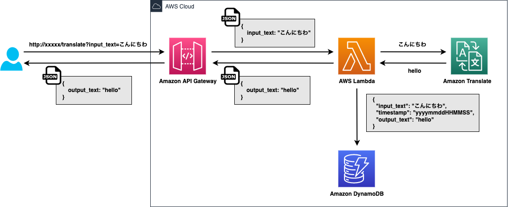
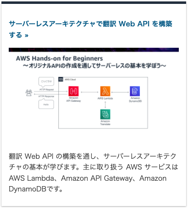
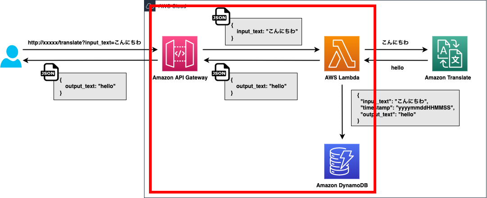
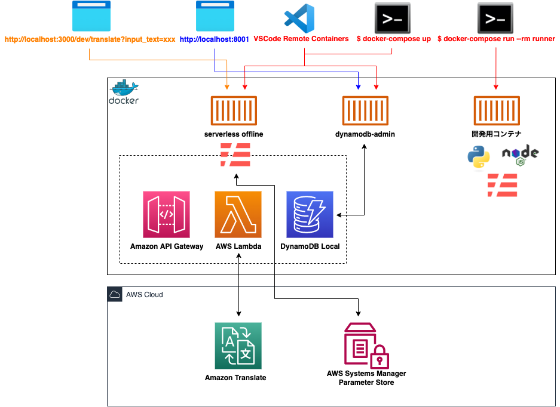
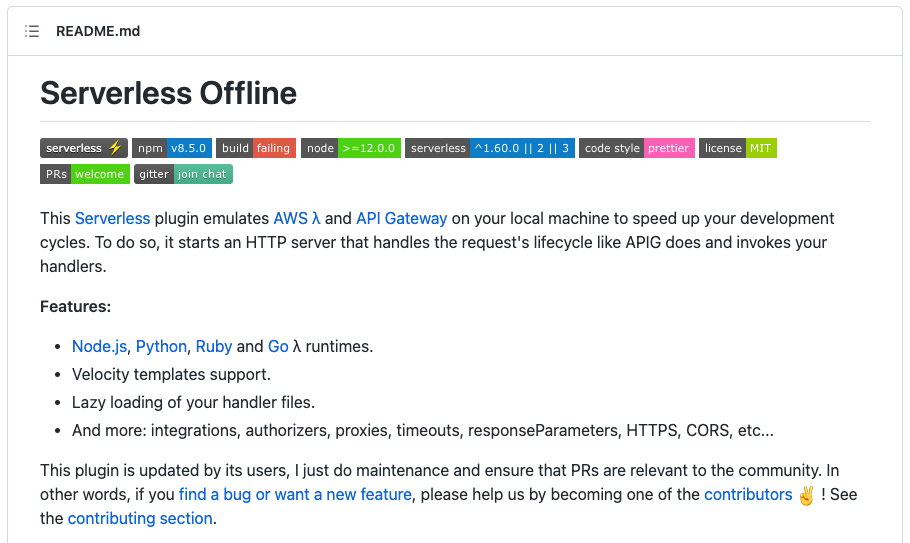
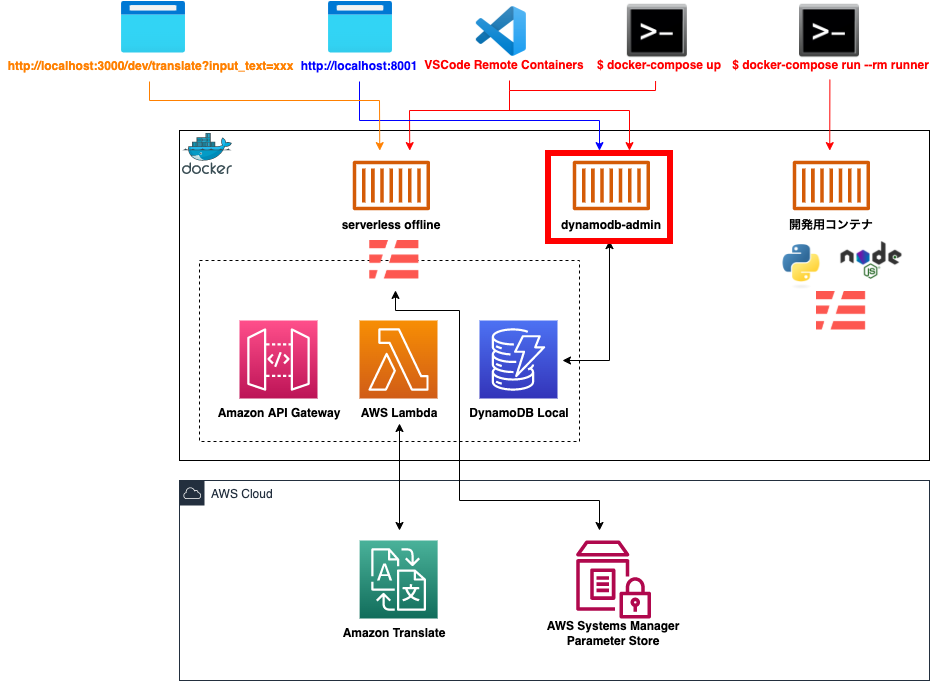
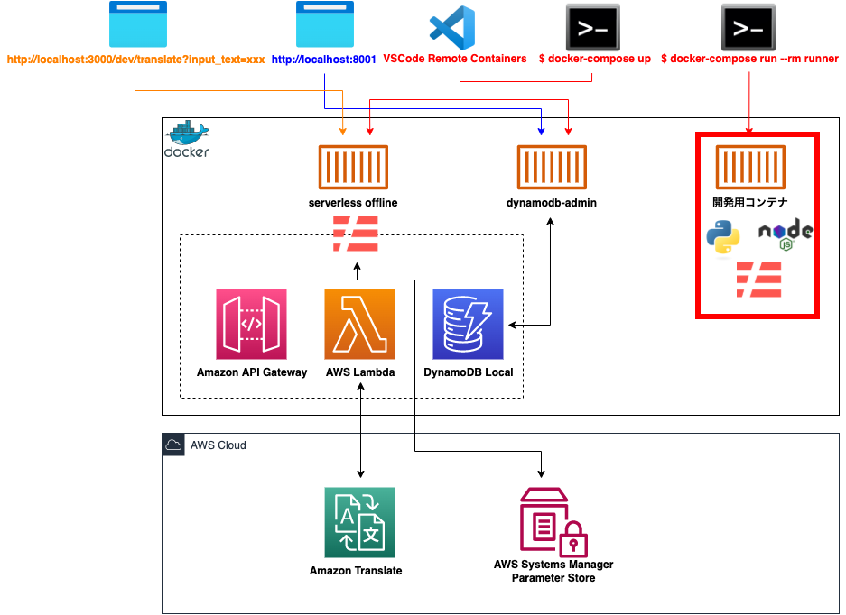
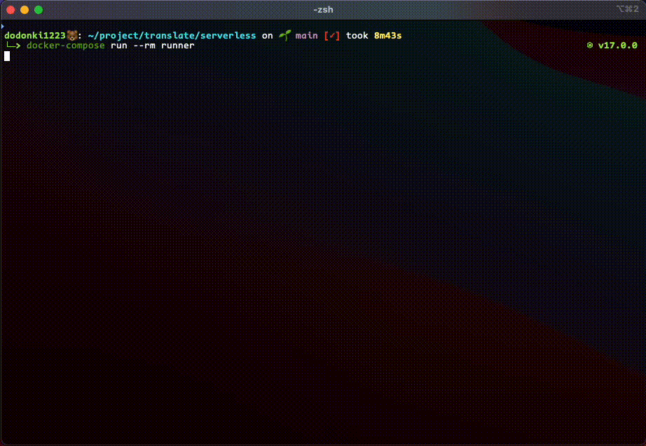
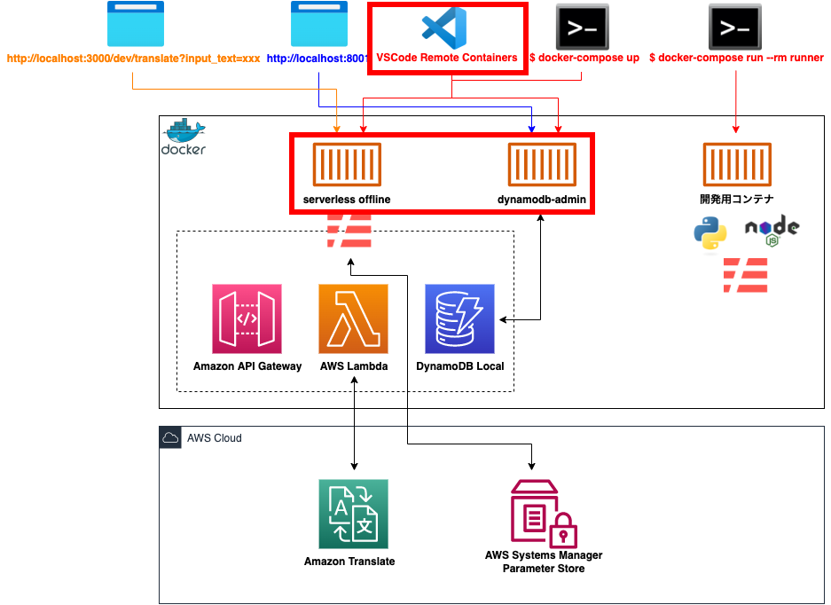
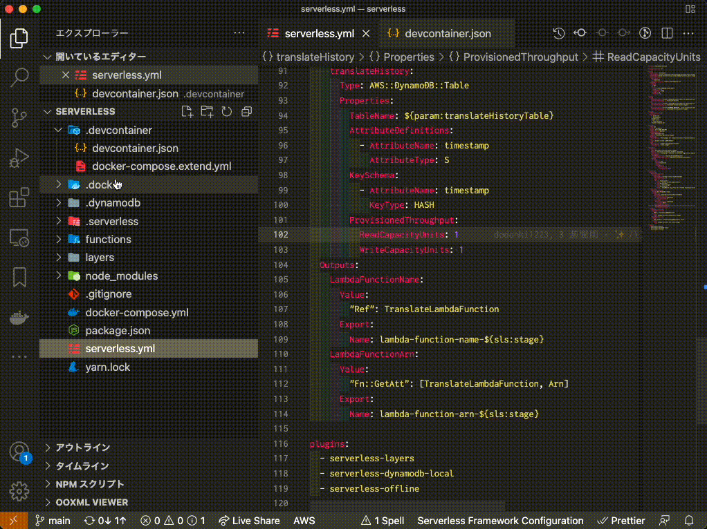

# サーバーレスアーキテクチャで翻訳 Web API を作成した

---

<style scoped>
p {
    text-align:left;
}
</style>

# 今日話すこと

- Web API の全体構成
- AWS ハンズオン資料
- Serverless Framework について
- ローカル環境について
- 作成 Web API の実演
- 開発方法について
- なぜ Docker で開発をするのか？

全部でスライドが38枚です

---

## こんな感じの構成です



---

<style scoped>
h1 {
    font-size: 47px;
    text-align: left;
}
</style>

# 実はこれ…… 
# AWS ハンズオン資料をパクって作成しました（笑）

---



[AWS Hands-on for Beginners 〜 Serverless 編 〜](https://pages.awscloud.com/event_JAPAN_Hands-on-for-Beginners-Serverless-2019_Contents.html)

---

<style scoped>
h2 {
    font-size: 39px;
    text-align: left;
    color: red;
}
</style>

# ハンズオン資料の良いところ

- 10個の動画しかない
- １つの動画が11分以内で終わる
- サービスごとの説明から作成まで行う
- 一般的なサーバーレスアーキテクチャである
- 自分が実際にやった時は２時間もかからず終わった

## サーバーレスアーキテクチャの触りとしてはとても良い！！！

--- 

<style scoped>
h2 {
    font-size: 39px;
    text-align: left;
    color: red;
}
</style>

# ハンズオン資料の悪いところ

- 本当に触りしかやらない
- Infrastructure as Code（IaC） ではない

## 残念ながらそのまま業務に使えるわけではない！！！

---

<style scoped>
h1, h2 {
    text-align: left;
}
</style>

# 今日の発表の本題はここからです
## このハンズオンだけだとイケてないよね :thinking:
## 僕らはカッチョ良く開発したいんだ！！！！！

---

<style scoped>
h1 {
    font-size: 55px;
}
</style>

# とりあえず目的をはっきりとさせます！

---

<style scoped>
h4 {
    text-align: left;
}
li {
    font-size: 32px;
}
</style>

# 今回の目的です

- ローカルにカッチョ良くエミュレートして開発できる環境を整える
- DynamoDB をローカルで使用できるようにする
- Serverless Framework を１から作成して使ってみる
- 既に作成してあるインフラをインポートしてコードに落とし込む（IaC）
- Terraform と Serverless Framework の連携を可能にする
- Terraform で workspace を使用して環境ごとインフラを作成してみる

--- 

<style scoped>
h4 {
    text-align: left;
}
li {
    font-size: 32px;
}
li:nth-child(1), li:nth-child(2), li:nth-child(3)  {
    color: red;
}
</style>

# 今回の目的です

- ローカルにカッチョ良くエミュレートして開発できる環境を整える
- DynamoDB をローカルで使用できるようにする
- Serverless Framework を１から作成して使ってみる
- 既に作成してあるインフラをインポートしてコードに落とし込む（IaC）
- Terraform と Serverless Framework の連携を可能にする
- Terraform で workspace を使用して環境ごとインフラを作成してみる

---

<style scoped>
h1 {
    text-align: left;
}
</style>

# 話の内容の大半は Serverless Framework のことが中心になります

---

<style scoped>
blockquote {
    font-size: 28px;
}
</style>

# Serverless Framework とは？

> All-in-one development & monitoring of auto-scaling apps on AWS Lambda

- Lambda の開発に特化している
- Infrastructure as Code（IaC）
- ローカルでサーバーレスアーキテクチャのエミュレートが可能
- デプロイがコマンド１つで可能（CI/CDも完結）
- 環境別のインフラを簡単に作成可能
- 豊富な plugin によって拡張できる

---

# 改めておさらい


---

# ローカルでエミュレートした箇所



---

# では、実際にローカル環境を見ていきましょう！

---

<style scoped>
img {
    width: 70%;
}
</style>

# ローカル環境の全体図



---

<style scoped>
img {
    width: 70%;
}
</style>

# serverless offline コンテナ


---

# serverless offline コンテナ



---

<style scoped>
h2 {
    text-align: left;
}
</style>

# serverless offline コンテナ

- Serverless Framework のプラグインで AWS Lambda と API Gateway をローカルでエミュレートするツール
- 更にプラグインを追加することで AWS Lambda と API Gateway 以外もローカルでエミュレートすることができる

## 代表的なエミュレート例

- DynamoDB
- AppSync

---

<style scoped>
img {
    width: 70%;
}
</style>

# dynamodb-admin コンテナ



---

<style scoped>
img {
    width: 70%;
}
</style>

# dynamodb-admin コンテナ


---

# 実際に見てみましょう！

---

<style scoped>
h1 {
    text-align: left;
}
</style>

# ここからは
# 開発方法について紹介していきます

---

<style scoped>
h1, p {
    text-align: left;
}
</style>

# 開発方法

２つの開発方法があり、好みで選べるようにしてあります

- 開発用のコンテナにログインして開発を行う
- VSCode の Remote Containers を使用して offline コンテナにログインして開発を行う

---

<style scoped>
img {
    width: 70%;
}
</style>

# 開発用のコンテナ



---

<style scoped>
img {
    width: 75%;
}
</style>

# 開発用のコンテナ



---

<style scoped>
h4 {
    text-align: left;
}
</style>

# 開発用のコンテナ

#### 起動コマンド

```shell
$ docker-compose run --rm runner
```

#### 用途

- Serverless Framework 関連のコマンドの実行
- AWS CLI からの実行
- テストの実行

---

<style scoped>
img {
    width: 70%;
}
</style>

# Remote Conteinars



---

<style scoped>
img {
    width: 65%;
}
</style>

# Remote Conteinars



---

# Remote Conteinars

とりあえず使ってみたかったので試してみただけです。  
また機会があれば発表しようと思います。

---

<style scoped>
h1 {
    font-size: 55px;
}
</style>

# なぜ Docker を使って開発しているのか？

---

#### DynamoDB Local が M1 Mac に対応していない！

---

### DynamoDB Local が M1 Mac に対応していない！！

---

## DynamoDB Local が M1 Mac に対応していない！！！

---

# DynamoDB Local が M1 Mac に対応していない！！！！

---

# だから仕方なく Docker 化した 😇

最近、 DynamoDB を扱うプラグインが Docker に対応されたため Docker 化しなくても使えるかも :thinking:

詳しくは [こちら - Support dockerized environment](https://github.com/99x/dynamodb-localhost/issues/63)

---

# 今日の発表を終わります

興味がある人はこちらの [リポジトリ](https://github.com/dodonki1223/translate) を覗いて下さい！
