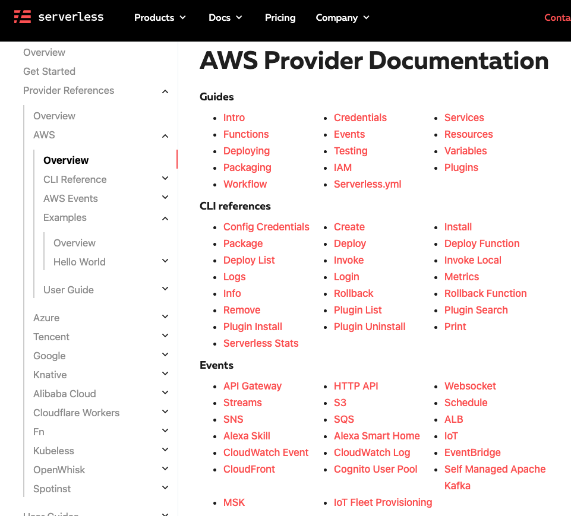
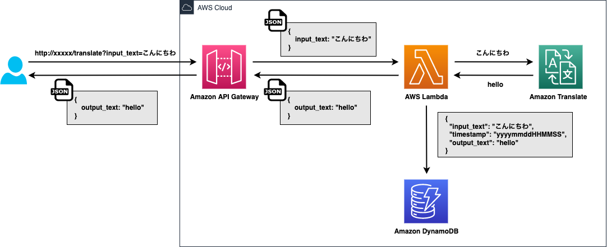
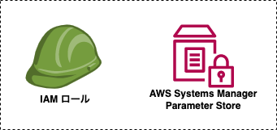
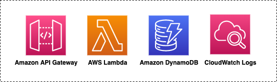
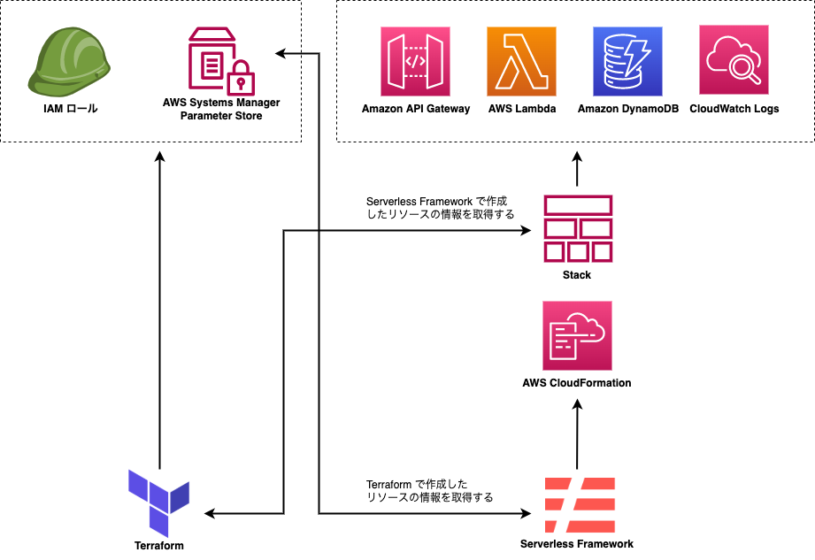
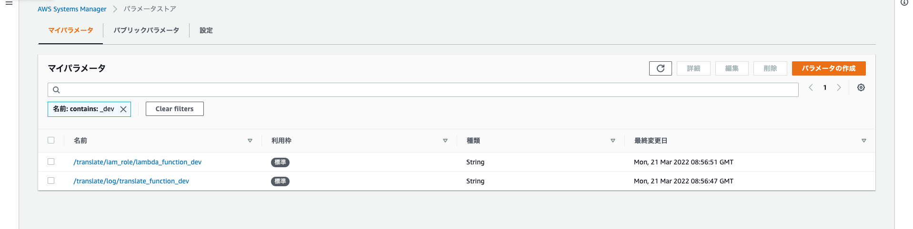
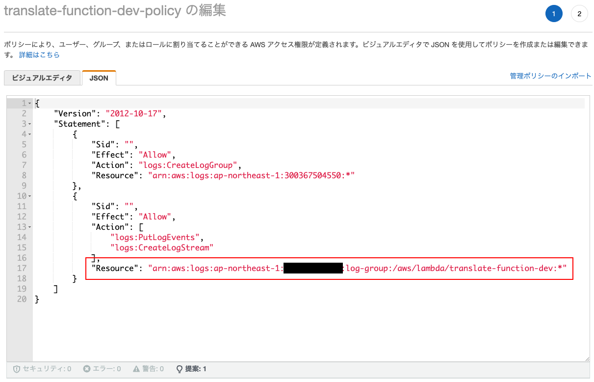

<style>
p, h1, h2, h3, h4 {
  text-align: left;
}
</style>

<style scoped>
h1 {
  font-size: 70px;
}
</style>

# 僕は Terraform と Serverless Framework の相互連携したいんだ

<div>
  </img>
</div>

---

### 基本は Terraform でインフラの構築
### ですが……
### サーバーレスアーキテクチャの場合は Serverless Framework で構築

---


## こんなことってありますよね？
## そもそもなんだけど全部 Terraform で良くない？

---

#### Terraform と Serverless Framework を比べる

API Gateway, AWS Lambda 構成の簡単なサーバーレスアーキテクチャで考えます:thinking:

---

<style scoped>
li {
  font-size: 31px;
}
</style>

Terraform のドキュメントより

- [Deploy Serverless Applications with AWS Lambda and API Gateway　](https://learn.hashicorp.com/tutorials/terraform/lambda-api-gateway?in=terraform/aws)

---

<style scoped>
li {
  font-size: 31px;
}
</style>

Serverless Framework のドキュメントより

- [Hello World Node.js Example](https://www.serverless.com/framework/docs/providers/aws/examples/hello-world/node)
- [Serverless Framework - AWS Lambda Events - API Gateway　　　　　](https://www.serverless.com/framework/docs/providers/aws/events/apigateway#simple-http-endpoint)

---

# 圧倒的記述量の差

<div>
  </img>
</div>
出典：『賭博黙字禄カイジ』9巻17ページより

---

## Serverless Framework で嬉しい事

<div>
  </img>
</div>

---

## Serverless Framework で嫌な事

- 短い記述量でいろいろと勝手に作ってくれる（何が作られるかわからない）
- お前、最終的に AWS CloudFormation やんけ！
- Serverless Framework が作った AWS CloudFormation を読む必要が出てくる

---

<style scoped>
img {
  width: 58%;
}
</style>

### 意外に出来るぞ Serverless Framework！

<div>
  </img>
</div>

---

皆さんはどんな時、Serverless Framework を使いますか？
もしよければ教えて下さい！

---

# ここから今日の本題です！

- サーバーレスアーキテクチャ作成した Web API の紹介
- Terraform と Serverless Framework でそれぞれ何を管理させるのか？
- Terraform と Serverless Framework の連携

---

#### Terraform と Serverless Framework を使って翻訳 Web API を作成してみました



---

# Web API の実演です

---

### Terraform と Serverless Framework でそれぞれ何を管理させるのか？

<div>
  </img>
</div>

---

業務でちゃんと使って開発したことがないのでイマイチイメージがわかないんですが、これから紹介することは何も考えずに分けました。

#### 何をどう分けたらいいか皆さんの意見をもらえると嬉しいです！

というか教えて下さい :bow::bow::bow::bow::bow:

---

<style scoped>
img {
  width: 70%;
}
</style>

# Terraform 管理化



---

<style scoped>
img {
  width: 100%;
}
</style>

# Serverless Framework 管理化



---

<style scoped>
h4 {
  text-align: left;
}
</style>

# どうやって連携するの？

連携というと以下の２つが考えられると思います。

#### ・Serverless Framework　→　Terraform
#### ・Terraform　→　Serverless Framework

---

<style scoped>
img {
  width: 70%;
}
</style>

# とりあえず全体図

<div>
  </img>
</div>

---

<style scoped>
p {
  font-size: 30px;
}
</style>

### Serverless Framework → Terraform

Serverless Framework から Terraform で作成されたリソースにアクセスする方法ですが、Serverless Framework の公式のブログに紹介されています。

・[The definitive guide to using Terraform with the Serverless Framework](https://www.serverless.com/blog/definitive-guide-terraform-serverless/)

---

<style scoped>
p {
  font-size: 30px;
}
img {
  width: 100%;
}
pre {
  font-size: 27px;
}
</style>

### Serverless Framework → Terraform

arn などをパラメータストアにセットしてそれを Serverless Framework で読み込むようにする。

<div>
  </img>
</div>

```yml
custom:
  iamRoleName: ${ssm:/translate/iam_role/lambda_function_${sls:stage}}
```

---

<style scoped>
p {
  font-size: 30px
}
img {
  width: 63%;
}
</style>

### Serverless Framework → Terraform

IAM ポリシーを作る時、リソースで絞り込みたいため Terraform で CloudWatch Logs を作り参照しようと思ったが……

<div>
  </img>
</div>

---
