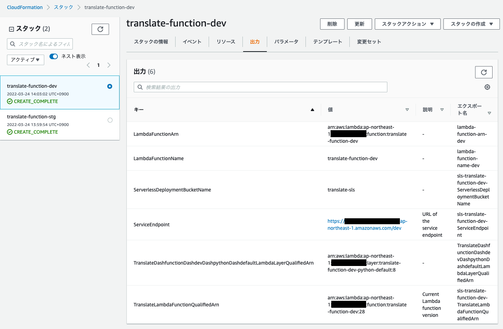
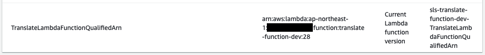

<style>
p, h1, h2, h3, h4 {
  text-align: left;
}
</style>

<style scoped>
h1 {
  font-size: 70px;
}
</style>

# 僕は Terraform と Serverless Framework の相互連携したいんだ

<div>
  </img>
</div>

---

### 基本は Terraform でインフラの構築
### ですが……
### サーバーレスアーキテクチャの場合は Serverless Framework で構築

---


## こんなことってありますよね？
## そもそもなんだけど全部 Terraform で良くない？

---

#### Terraform と Serverless Framework を比べる

API Gateway, AWS Lambda 構成の簡単なサーバーレスアーキテクチャで考えます:thinking:

---

<style scoped>
li {
  font-size: 31px;
}
</style>

Terraform のドキュメントより

- [Deploy Serverless Applications with AWS Lambda and API Gateway　](https://learn.hashicorp.com/tutorials/terraform/lambda-api-gateway?in=terraform/aws)

---

<style scoped>
li {
  font-size: 31px;
}
</style>

Serverless Framework のドキュメントより

- [Hello World Node.js Example](https://www.serverless.com/framework/docs/providers/aws/examples/hello-world/node)
- [Serverless Framework - AWS Lambda Events - API Gateway　　　　　](https://www.serverless.com/framework/docs/providers/aws/events/apigateway#simple-http-endpoint)

---

<style scoped>
img {
  width: 80%;
}
ul {
  display: flex;
  list-style: none;
}
</style>

# 圧倒的記述量の差

<ul style="text-align: center;">
  <li></img></li>
  <li></img></li>
</ul>

---

<style scoped>
img {
  width: 80%;
}
ul {
  display: flex;
  list-style: none;
}
</style>

## Serverless Framework で嬉しい事

#### まったく、ローカルエミュレートは最高だぜ！！

<ul style="text-align: center;">
  <li></img></li>
  <li></img></li>
</ul>

---

## Serverless Framework で嫌な事

- 短い記述量でいろいろと勝手に作ってくれる（何が作られるかわからない）
- お前、最終的に AWS CloudFormation やんけ！
- Serverless Framework が作った AWS CloudFormation を読む必要が出てくる

---

<style scoped>
img {
  width: 54%;
}
</style>

### 意外に出来るぞ Serverless Framework！

<div>
  </img>
</div>

---

皆さんはどんな時、Serverless Framework を使いますか？
もしよければ教えて下さい！

---

# ここから今日の本題です！

- サーバーレスアーキテクチャ作成した Web API の紹介
- Terraform と Serverless Framework でそれぞれ何を管理させるのか？
- Terraform と Serverless Framework の連携
- Terraform と Serverless Framework を相互連携して思ったこと

---

#### Terraform と Serverless Framework を使って翻訳 Web API を作成してみました


---

# Web API の実演です

---

### Terraform と Serverless Framework でそれぞれ何を管理させるのか？

<div>
  </img>
</div>

---

業務でちゃんと使って開発したことがないのでイマイチイメージがわかないんですが、これから紹介することは何も考えずに分けました。

#### 何をどう分けたらいいか皆さんの意見をもらえたら嬉しいです！

---

<style scoped>
img {
  width: 70%;
}
</style>

# Terraform 管理化

<div>
  </img>
</div>

---

<style scoped>
img {
  width: 100%;
}
</style>

# Serverless Framework 管理化


---

<style scoped>
h4 {
  text-align: left;
}
</style>

# どうやって連携するの？

連携というと以下の２つが考えられると思います。

#### ・Serverless Framework　→　Terraform
#### ・Terraform　→　Serverless Framework

---

<style scoped>
img {
  width: 70%;
}
</style>

# とりあえず全体図

<div>
  </img>
</div>

---

<style scoped>
p {
  font-size: 30px;
}
</style>

### Serverless Framework → Terraform

Serverless Framework から Terraform で作成されたリソースにアクセスする方法ですが、Serverless Framework の公式のブログに紹介されています。

・[The definitive guide to using Terraform with the Serverless Framework](https://www.serverless.com/blog/definitive-guide-terraform-serverless/)

---

<style scoped>
p {
  font-size: 30px;
}
img {
  width: 100%;
}
pre {
  font-size: 26px;
}
</style>

### Serverless Framework → Terraform

arn などをパラメータストアにセットしてそれを Serverless Framework で読み込むようにする。

<div>
  </img>
</div>

```yml
custom:
  iamRoleName: ${ssm:/translate/iam_role/lambda_function_${sls:stage}}
```

---

<style scoped>
p {
  font-size: 30px
}
img {
  width: 64%;
}
</style>

### Serverless Framework → Terraform

IAM ポリシーを作る時、リソースで絞り込みたいため Terraform で CloudWatch Logs を作り参照しようと思ったが……

<div>
  </img>
</div>

---

### Serverless Framework → Terraform

Serverless Framework で 使用する CloudWatch Logs を arn で指定する方法がなかったため、同じ名前にしたらエラーになってしまったりと **CloudFormation 力が足りなくて** 結局やめてしまった。
Terraform で locals で LogGroupName を管理させ、パラメータストア経由で LogGroupName を Serverless Framework では参照するようにした。

---

<style scoped>
pre:nth-child(3) {
  font-size: 23px;
}
pre:nth-child(5) {
  font-size: 27.5px;
}
</style>

### Serverless Framework → Terraform

Terraform

```terraform
locals {
  log_group_name = format("/aws/lambda/translate-function-%s", terraform.workspace)
}
```

Serverless Framework

```yml
custom:
  logGroupName: ${ssm:/translate/log/translate_function_${sls:stage}}

resources:
  extensions:
    TranslateLogGroup:
      Properties:
        LogGroupName: ${self:custom.logGroupName}
        RetentionInDays: 30
```

---

### Terraform → Serverless Framework

CloudFormation の Stack が出力した値を Terraform 側で読み込むことで Serverless Framework が作成したリソースにアクセスすることができるようになります。

---

<style scoped>
img {
  width: 70%;
}
</style>

### Terraform → Serverless Framework

<div>
  </img>
</div>

---

<style scoped>
pre {
  font-size: 19px;
}
</style>

### Terraform → Serverless Framework

CloudFormation Stack

<div>
  </img>
</div>

Terraform

```terraform
data "aws_cloudformation_export" "lambda_function_qualified_arn" {
  name = format("sls-translate-function-%s-TranslateLambdaFunctionQualifiedArn", terraform.workspace)
}
```

---

## 相互連携をしてみて思ったこと :thinking:

---

<style scoped>
img {
  width: 80%;
}
ul {
  display: flex;
  list-style: none;
}
</style>

#### 相互連携させる時に
#### 重要なのは **デプロイ順** である！

<ul style="text-align: center;">
  <li></img></li>
  <li></img></li>
</ul>

---

現状だと Serverless Framework は Terraform に必ず依存している状態になっています。

バッチなどにおいては冪等性（べきとうせい）の考え方はすごく重要だと思っていますが、インフラにおいてはどうなんでしょうか？

---

<style scoped>
img {
  width: 65%;
}
</style>

# 終わり

