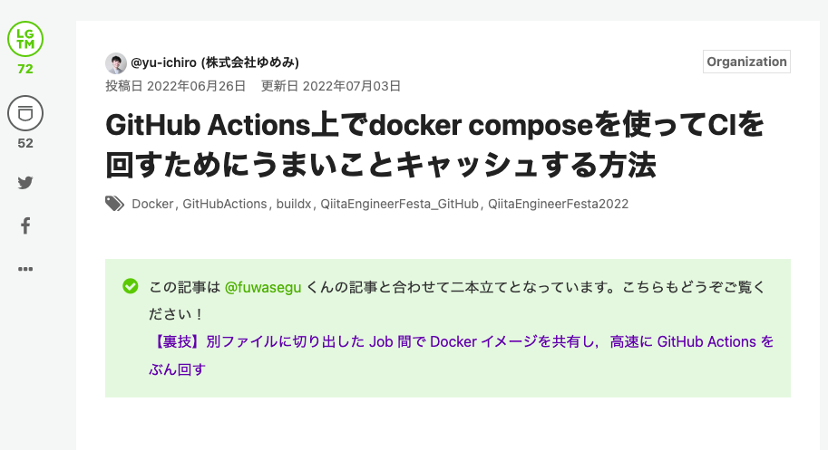
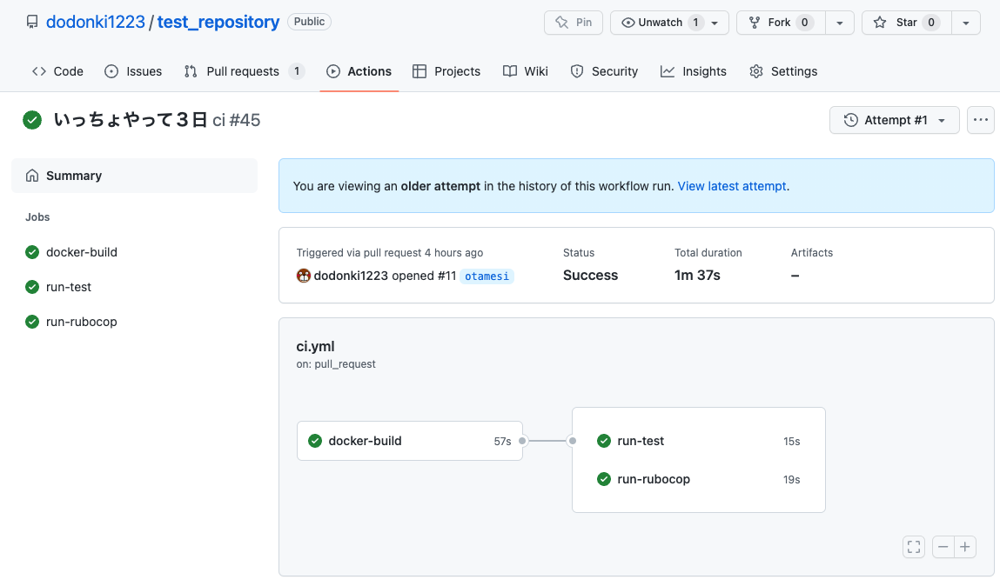
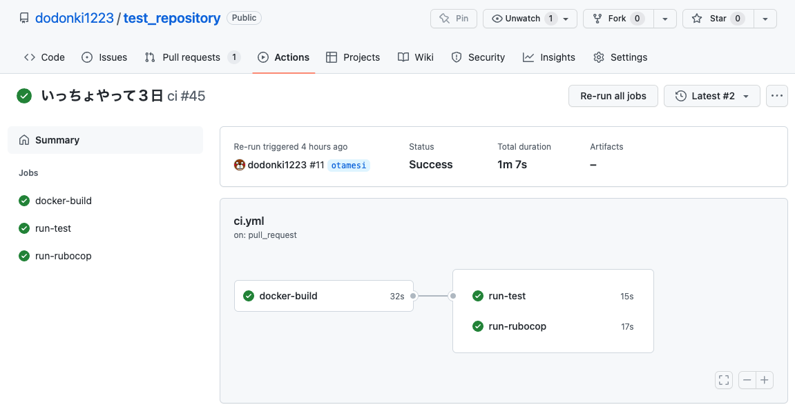

# Docker を使った GitHub Actions で高速に処理させる

---

# こんな記事を見つけました！

    

引用：https://qiita.com/yu-ichiro/items/c1a1248c0cdeeb0e6b42

---

# ワイ「これはやりたかったことにマッチするな 🤔」

---

# Dockerを使った開発でのGitHub Actionsの課題

- ## テストとLinterを別のJobで定義するとそれぞれのJobごとにbuild, up する必要があった（要は遅い）
- ## Docker の build した結果を使いまわしたかった（使えなくて要は遅い）
- ## 遅い遅い遅い遅い遅い遅い遅い遅い遅い遅い遅い遅い……

---

# 記事の概要図

    

引用：https://qiita.com/yu-ichiro/items/c1a1248c0cdeeb0e6b42

---

# ワイ「これは一体どういうことだってばよ😅」

---

# ワイ「Local Registryね……ふむふむ。あぁー聞いたことある気がするわ（知らん」
# ワイ「Buildxね……ふむふむ、どうせBuildkitのことやろそれ（合ってた」

---

# この記事を理解するのにはまだ自分の知識が足りなかったようだ😇

---

# Local Registry とは？

> レジストリ（registry）とは、ストレージとコンテント配送システムであり、Docker イメージの名前を異なったタグを付けられたバージョンで保持します。

Docker Registry をローカルに立てて使用することを指す。

詳しくはこちらを参照してみてください。

- https://docs.docker.jp/registry/introduction.html

---

# Local Registry とは？

概要図ではローカル上に Docker Hub みたいなものを立ててそこに image を push し Job では push した Image を pull して使用することが記事で書かれています！

---

# Buildx とは？

> Docker Buildx は Docker コマンドを拡張する CLI プラグインであり、Moby BuildKit ビルダーツールキットにより提供される機能に完全対応するものです。 Docker ビルドと同様のユーザー操作を提供し、さらにスコープ化されたビルダーインスタンス、複数ノードへの同時ビルドなど、数多くの新機能を提供します。

詳しくはこちらを参照してみてください。

- https://matsuand.github.io/docs.docker.jp.onthefly/buildx/working-with-buildx/

---

# Buildx とは？

今回の使用範囲では Docker build 時に cache をエクスポートしてそれを読み込むことで docker build を速く終わらすアプローチを行っています。
キャッシュのタイプはいくつかありますが記事では local を使用しています。

詳しくはこちらを参照してみてください。

- https://github.com/moby/buildkit#export-cache

---

# 改めて記事の概要図

    

引用：https://qiita.com/yu-ichiro/items/c1a1248c0cdeeb0e6b42

---

# ワイ「実際に実装してみて確認してみるか！」

---

# キャッシュなし

    

---

# キャッシュあり

    

---

# ワイ「これは画期的や！」

---

# お・わ・り
