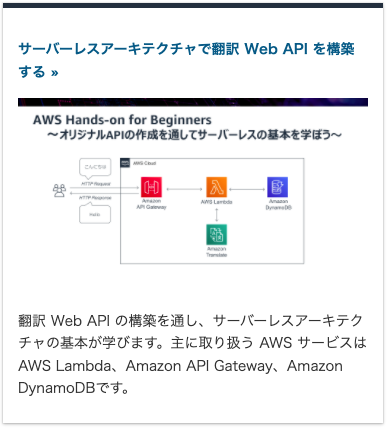
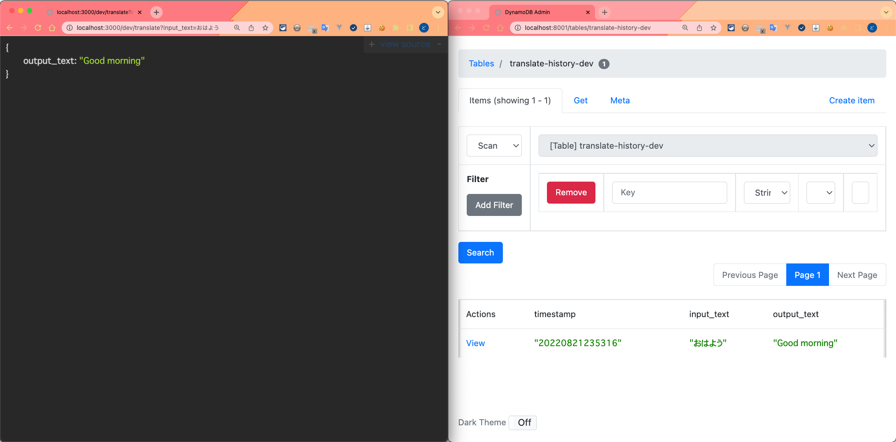
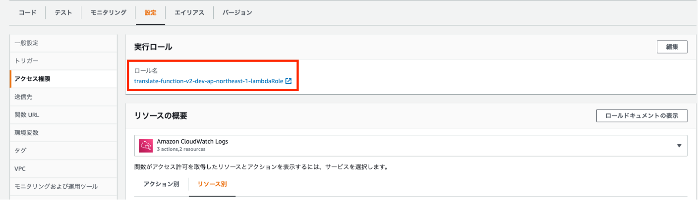
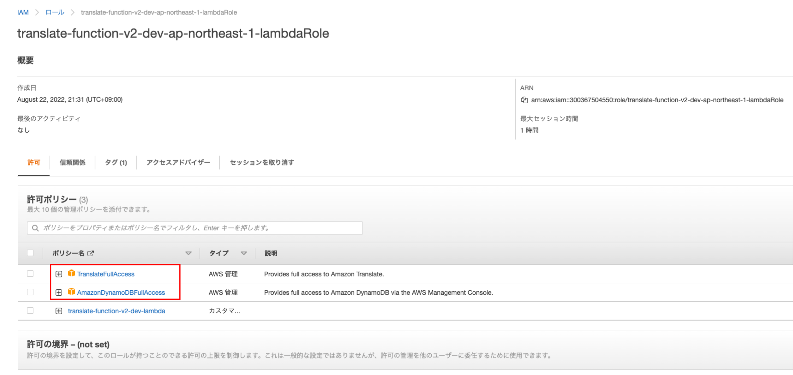
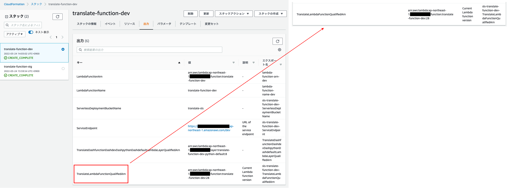

<!--
AWS のハンズオン資料の「サーバーレスアーキテクチャで翻訳 Web API を構築する」（https://pages.awscloud.com/event_JAPAN_Hands-on-for-Beginners-Serverless-2019_Contents.html）を題材にしてハンズオンで作成したインフラをコード化していく流れを発表します。

主に以下のようなことを発表しようと思っています。
・コンソール画面で作成したインフラの一部を Terraformer(https://github.com/GoogleCloudPlatform/terraformer) を使ってコード化し体裁を整えながら再実装していった方法
・Terraform で作成したリソースを Serverless Framework で参照する方法
・Serverless Framework で作成したリソースを Terraform で参照する方法
-->

<!-- _class: delimiter -->

<style scoped>
section { padding-top: 5rem !important; } 
</style>

# Terraform と Serverless Framework を相互連携する

<div style="text-align: center;padding-top: 80px">
  
</div>

<h2 style="text-align: right; margin-right: 4rem">Yuki Takagi</h2>

---

<!-- _class: delimiter -->

<style scoped>
section { padding-top: 5rem !important; } 
</style>

# 自己紹介

---

<div style="height: 100%">
  <h1>自己紹介</h1>
  <p style="border-bottom: solid 5px #808080; margin-top: -2rem"></p>

  <div style="height: 100%; display: flex;justify-content: space-between; margin: 1rem;">
    <div style="width: 50%; background: url(https://scontent-nrt1-1.xx.fbcdn.net/v/t1.6435-9/119604723_3285085514901787_1350492750591504360_n.jpg?_nc_cat=111&ccb=1-7&_nc_sid=09cbfe&_nc_ohc=HmLep5LV4WoAX8Rw7VN&tn=T6b3UBCIVq3UemOD&_nc_ht=scontent-nrt1-1.xx&oh=00_AT9LfFhBMp6HJL0PEV4OBOodt0dhVG9kVuSD1IcR8Dit1g&oe=6326B72D) no-repeat top left; background-size: 100%"></div>
    <div style="width: 50%;">
      <!-- 名前 -->
      <p style="margin-left: 2rem;"><b>名前</b></p>
      <p style="margin-left: 4rem; margin-top: -1rem;">高木 勇気</p>
      <!-- エンジニア職 -->
      <p style="margin-left: 2rem;"><b>エンジニア職</b></p>
      <p style="margin-left: 4rem; margin-top: -1rem;">バックエンドエンジニア</p>
      <!-- アカウント -->
      <p style="margin-left: 2rem;"><b>Twitter, GitHub, Qiita, Zenn</b></p>
      <p style="margin-left: 4rem; margin-top: -1rem;">@dodonki1223</p>
      <!-- 所属 -->
      <p style="margin-left: 2rem;"><b>所属</b></p>
      <p style="margin-left: 4rem; margin-top: -1rem;">株式会社LegalForce</p>
      <!-- 所属 -->
    </div>
  </div>
</div>

---

<div style="height: 100%">
  <h1>自己紹介</h1>
  <p style="border-bottom: solid 5px #808080; margin-top: -2rem"></p>

  <h3>最近の活動</h3>

  <div  style="height: 100%; display: flex;justify-content: space-between;">
    <div style="width: 50%; background: url(./image/01_qiita.png) no-repeat top left; background-size: 72%"></div>
    <div style="width: 50%; background: url(./image/02_article.png) no-repeat top left; background-size: 90%"></div>
  </div>
</div>

---

<!-- _class: delimiter -->

<style scoped>
section { padding-top: 5rem !important; } 
</style>

# 今日話すこと

---

<div style="height: 100%">
  <h1>今日話すこと</h1>
  <p style="border-bottom: solid 5px #808080; margin-top: -2rem"></p>

  ## ふと Terraform と Serverless Framework はどうやって連携すればいいのか？という疑問を持ちました。

  ## ちょうどいい題材もあったので実際に試してみました 💪

  ## 今日は実際に試した結果、私が得た知見を発表したいと思います！
</div>

---

<!-- _class: delimiter -->

<div style="height: 100%">
  <h1>アジェンダ</h1>
  <p style="border-bottom: solid 5px #808080; margin-top: -2rem"></p>

  <div style="padding-left: 2rem;">
    <h2 style="padding: 0;">1. 題材</h2>
    <h2 style="padding: 0; color: gray;">2. Terraform と Serverless Framework で管理するもの</h2>
    <h2 style="padding: 0; color: gray;">3. Serverless Framework を使ってコード化</h2>    
    <h2 style="padding: 0; color: gray;">4. Terrafomer を使ってコード化</h2>
    <h2 style="padding: 0; color: gray;">5. Serverless Framework → Terraform を連携する</h2>
    <h2 style="padding: 0; color: gray;">6. Terraform → Serverless Framework を連携する</h2>
    <h2 style="padding: 0; color: gray;">7. まとめ</h2>
  </div>
</div>

---

<div style="height: 100%">
  <h1>1. 題材</h1>
  <p style="border-bottom: solid 5px #808080; margin-top: -2rem"></p>

  ### こんな感じのサーバーレスアーキテクチャを題材にします。

  <div style="padding-top:2rem;">
    
  </div>
</div>

---

<div style="height: 100%">
  <h1>1. 題材</h1>
  <p style="border-bottom: solid 5px #808080; margin-top: -2rem"></p>

  ### こちらの構成は **AWS 初心者向けハンズオン** の「 **[サーバーレスアーキテクチャで翻訳 Web API を構築する](https://pages.awscloud.com/event_JAPAN_Hands-on-for-Beginners-Serverless-2019_Contents.html)** 」で作成する題材になります。

  <div style="text-align: center;padding-top: 2rem;">
    
  </div>
</div>

---

<div style="height: 100%">
  <h1>1. 題材</h1>
  <p style="border-bottom: solid 5px #808080; margin-top: -2rem"></p>

  ## **AWS 初心者向けハンズオン** の「 **[サーバーレスアーキテクチャで翻訳 Web API を構築する](https://pages.awscloud.com/event_JAPAN_Hands-on-for-Beginners-Serverless-2019_Contents.html)** 」は動画を10個見ながら言われたとおりにしていくだけで2時間もあれば簡単に実装することが出来ます。

  ## 私もこちらのハンズオンの終了後に Terraform と Serverless Framework を使って実装し直しました。

  ## 実装していった過程も含めて発表していきます！
</div>

---

<!-- _class: delimiter -->

<div style="height: 100%">
  <h1>アジェンダ</h1>
  <p style="border-bottom: solid 5px #808080; margin-top: -2rem"></p>

  <div style="padding-left: 2rem;">
    <h2 style="padding: 0; color: gray;">1. 題材</h2>
    <h2 style="padding: 0;">2. Terraform と Serverless Framework で管理するもの</h2>
    <h2 style="padding: 0; color: gray;">3. Serverless Framework を使ってコード化</h2>
    <h2 style="padding: 0; color: gray;">4. Terrafomer を使ってコード化</h2>
    <h2 style="padding: 0; color: gray;">5. Serverless Framework → Terraform を連携する</h2>
    <h2 style="padding: 0; color: gray;">6. Terraform → Serverless Framework を連携する</h2>
    <h2 style="padding: 0; color: gray;">7. まとめ</h2>
  </div>
</div>

---

<div style="height: 100%">
  <h1>2. Terraform と Serverless Framework で管理するもの</h1>
  <p style="border-bottom: solid 5px #808080; margin-top: -2rem"></p>

  <div style="text-align: center; padding-top:1rem;">
    
  </div>
</div>

---

<div style="height: 100%">
  <h1>2. Terraform と Serverless Framework で管理するもの</h1>
  <p style="border-bottom: solid 5px #808080; margin-top: -2rem"></p>

  ## Terraform では **IAM ロール** と **AWS Systems Manager Parameter Store** の2つを管理します。

  ## 後に説明しますが **AWS Systems Manager Parameter Store** は Serverless Framework と連携するために必要になります。

  <div style="text-align: center;">
    
  </div>
</div>

---

<div style="height: 100%">
  <h1>2. Terraform と Serverless Framework で管理するもの</h1>
  <p style="border-bottom: solid 5px #808080; margin-top: -2rem"></p>

  ## Serverless Framework では **Amazon API Gateway** と **AWS Lambda** と **Amazon DynamoDB** と **CloudWatch Logs** の4つを管理します。

  <div style="text-align: center;margin-top: 6rem;">
    
  </div>
</div>

---

<div style="height: 100%">
  <h1>2. Terraform と Serverless Framework で管理するもの</h1>
  <p style="border-bottom: solid 5px #808080; margin-top: -2rem"></p>

  ## Serverless Framework で管理しているリソースが多くない？

  ## Serverless Framework で多くのリソースを管理しているのは **ローカルの開発環境が整っている** ためです。

  ## **ローカルの開発環境で使用する必要があるのものは Serverless Framework で管理** し **それ以外は Terraform で管理する** ようにしています。

  ## 今日はローカルの開発環境については詳しく説明しません。
</div>

---

<div style="height: 100%">
  <h1>2. Terraform と Serverless Framework で管理するもの</h1>
  <p style="border-bottom: solid 5px #808080; margin-top: -2rem"></p>

  ### ローカルにて実行と DynamoDB の操作ができます。

  <div style="text-align: center;">
    
  </div>
</div>

---

<!-- _class: delimiter -->

<div style="height: 100%">
  <h1>アジェンダ</h1>
  <p style="border-bottom: solid 5px #808080; margin-top: -2rem"></p>

  <div style="padding-left: 2rem;">
    <h2 style="padding: 0; color: gray;">1. 題材</h2>
    <h2 style="padding: 0; color: gray;">2. Terraform と Serverless Framework で管理するもの</h2>
    <h2 style="padding: 0;">3. Serverless Framework を使ってコード化</h2>
    <h2 style="padding: 0; color: gray;">4. Terrafomer を使ってコード化</h2>
    <h2 style="padding: 0; color: gray;">5. Serverless Framework → Terraform を連携する</h2>
    <h2 style="padding: 0; color: gray;">6. Terraform → Serverless Framework を連携する</h2>
    <h2 style="padding: 0; color: gray;">7. まとめ</h2>
  </div>
</div>

---

<div style="height: 100%">
  <h1>3. Serverless Framework を使ってコード化</h1>
  <p style="border-bottom: solid 5px #808080; margin-top: -2rem"></p>

**Serverless Framework コマンドをインストール**

```shell
$ npm install -g serverless
```

**フォルダを作成し移動**

```shell
$ mkdir serverless
$ cd serverless
```

**ハンズオンと同じ Python のプロジェクトを指定して作成する**

```shell
$ serverless create --template aws-python3 --name translate-function
```

**ハンズオンと同じファイル名に変更する**

```shell
$ mv handler.py translate_function.py
```
</div>

---

<style scoped>
code {
    font-size:23px;
}
</style>

<div style="height: 100%">
  <h1>3. Serverless Framework を使ってコード化</h1>
  <p style="border-bottom: solid 5px #808080; margin-top: -2rem"></p>

### **serverless という AWS profile を予め設定** しておきます。既に作成されている **serverless.yml** に以下の内容のように改修します。

```yml
service: translate-function

frameworkVersion: '3'

provider:
  name: aws
  runtime: python3.8
  region: ap-northeast-1
  profile: serverless

functions:
  translate:
    name: translate-function
    handler: translate_function.lambda_handler
```
</div>

---

<div style="height: 100%">
  <h1>3. Serverless Framework を使ってコード化</h1>
  <p style="border-bottom: solid 5px #808080; margin-top: -2rem"></p>

### **translate_function.py** も以下の内容のように改修します。

```python
import json

def lambda_handler(event, context):
    body = {
        "message": "Go Serverless v1.0! Your function executed successfully!",
        "input": event
    }

    response = {
        "statusCode": 200,
        "body": json.dumps(body)
    }

    return response
```

</div>

---

<div style="height: 100%">
  <h1>3. Serverless Framework を使ってコード化</h1>
  <p style="border-bottom: solid 5px #808080; margin-top: -2rem"></p>

  ### `serverless deploy` コマンドを実行すると AWS Lambda 以外にも **CloudWatch Logs, IAM Role が作成** されます。

  ### **IAM ロールは後に Terraform で作成したものに移行する予定です。**

  ### Amazon API Gateway, Amazon DynamoDB も作っていき、ハンズオンと同じ状態にしていきます。
</div>

---

<style scoped>
code {
    font-size:16px;
}
</style>

<div style="height: 100%">
  <h1>3. Serverless Framework を使ってコード化</h1>
  <p style="border-bottom: solid 5px #808080; margin-top: -2rem"></p>

  ### serverless.yml の **provider に endpointType** と **handler の下に events** を追加し Amazon API Gateway と AWS Lambda が繋ぎ込みされるようにします。**input_text** でクエリパラメータを取得できるようになります。

```yml
service: translate-function

frameworkVersion: '3'

provider:
  name: aws
  runtime: python3.8
  region: ap-northeast-1
  profile: serverless
  endpointType: regional

functions:
  translate:
    name: translate-function
    handler: translate_function.lambda_handler
    events:
      - http:
          method: get
          path: /translate
          request:
            parameters:
              querystrings:
                input_text: false
```
</div>

---

<div style="height: 100%">
  <h1>3. Serverless Framework を使ってコード化</h1>
  <p style="border-bottom: solid 5px #808080; margin-top: -2rem"></p>

  ### Amazon Translate, Amazon DynamoDB にアクセスできるように AWS Lambda で使用されている IAM ロールに一時的に権限を付与します。

  <div style="text-align: center; padding-top: 2rem;">
    
  </div>
</div>

---

<div style="height: 100%">
  <h1>3. Serverless Framework を使ってコード化</h1>
  <p style="border-bottom: solid 5px #808080; margin-top: -2rem"></p>

  ### TranslateFullAccess, AmazonDynamoDBFullAccess の権限を IAM ロールに追加します。

  <div style="text-align: center;">
    
  </div>
</div>

---

<style scoped>
code {
    font-size:11px;
}
</style>

<div style="height: 100%">
  <h1>3. Serverless Framework を使ってコード化</h1>
  <p style="border-bottom: solid 5px #808080; margin-top: -2rem"></p>

  ### serverless.yml に **resources** を追加し DynamoDB の table を作成します。

```yml
service: translate-function

frameworkVersion: '3'

provider:
  name: aws
  runtime: python3.8
  region: ap-northeast-1
  profile: serverless
  endpointType: regional

functions:
  translate:
    name: translate-function
    handler: translate_function.lambda_handler
    events:
      - http:
          method: get
          path: /translate
          request:
            parameters:
              querystrings:
                input_text: false

resources:
  Resources:
    usersTable:
      Type: AWS::DynamoDB::Table
      Properties:
        TableName: translate-history
        AttributeDefinitions:
          - AttributeName: timestamp
            AttributeType: S
        KeySchema:
          - AttributeName: timestamp
            KeyType: HASH
        ProvisionedThroughput:
          ReadCapacityUnits: 1
          WriteCapacityUnits: 1
```
</div>

---

<style scoped>
code { font-size:11px; }
</style>

<div style="height: 100%;">
  <h1>3. Serverless Framework を使ってコード化</h1>
  <p style="border-bottom: solid 5px #808080; margin-top: -2rem"></p>

  #### translate_function.py を改修し **日本語を英語に翻訳する機能** と **翻訳結果を DynamoDB に保存する処理** を実装します。

```python
import os
import boto3
import json
import datetime

translate = boto3.client('translate')
dynamodb_translate_history_tbl = boto3.resource('dynamodb').Table('translate-history')

def lambda_handler(event, context):
    input_text = event['queryStringParameters']['input_text']

    response = translate.translate_text(
        Text=input_text,
        SourceLanguageCode='ja',
        TargetLanguageCode='en',
    )

    output_text = response.get('TranslatedText')

    dynamodb_translate_history_tbl.put_item(
        Item = {
            'timestamp': datetime.datetime.now().strftime("%Y%m%d%H%M%S"),
            'input_text': input_text,
            'output_text': output_text
        }
    )

    return {
        'statusCode': 200,
        'body': json.dumps({
            'output_text': output_text
        }),
        'isBase64Encoded': False,
        'headers': {}
    }
```
</div>

---

<style scoped>
/* code { font-size:11px; } */
</style>

<div style="height: 100%;">
  <h1>3. Serverless Framework を使ってコード化</h1>
  <p style="border-bottom: solid 5px #808080; margin-top: -2rem"></p>

  ### これでハンズオンで作成した **サーバーレスアーキテクチャと同じ状態** になりました。

  ### 次は一部手動で作成していた **IAM ロール** を Terraform で実装していきます！

</div>

---

<!-- _class: delimiter -->

<div style="height: 100%">
  <h1>アジェンダ</h1>
  <p style="border-bottom: solid 5px #808080; margin-top: -2rem"></p>

  <div style="padding-left: 2rem;">
    <h2 style="padding: 0; color: gray;">1. 題材</h2>
    <h2 style="padding: 0; color: gray;">2. Terraform と Serverless Framework で管理するもの</h2>
    <h2 style="padding: 0; color: gray;">3. Serverless Framework を使ってコード化</h2>
    <h2 style="padding: 0;">4. Terrafomer を使ってコード化</h2>
    <h2 style="padding: 0; color: gray;">5. Serverless Framework → Terraform を連携する</h2>
    <h2 style="padding: 0; color: gray;">6. Terraform → Serverless Framework を連携する</h2>
    <h2 style="padding: 0; color: gray;">7. まとめ</h2>
  </div>
</div>

---

<div style="height: 100%;">
  <h1>4. Terrafomer を使ってコード化</h1>
  <p style="border-bottom: solid 5px #808080; margin-top: -2rem"></p>

  ### [Terraformer](https://github.com/GoogleCloudPlatform/terraformer) を使って Serverless Framework で仮で作成した **IAM ロールを取り込みコード化** します。

  ### Terraformer を使用することで **Terraform の管理化でないリソースをコード化** してくれるのでとても便利です！

  ### Terraformer は以下のコマンドで簡単にインストール可能です。

  ```shell
  $ brew install terraformer
  ```
</div>

---

<div style="height: 100%;">
  <h1>4. Terrafomer を使ってコード化</h1>
  <p style="border-bottom: solid 5px #808080; margin-top: -2rem"></p>

  ### フォルダを作成し移動

  ```shell
  $ mkdir terraform
  $ cd terraform
  ```

  ### AWS のリソースを操作できるように provider の設定ファイルを作成

  ```shell
  $ touch provider.tf
  ```

  ### AWS の provider の設定を書き込む（ **terraform という AWS profile を予め設定** しておきます）

  ```terraform
  provider "aws" {
    region  = "ap-northeast-1"
    profile = "terraform"
  }
  ```
</div>

---

<style scoped>
code { font-size: 17px }
</style>

<div style="height: 100%;">
  <h1>4. Terrafomer を使ってコード化</h1>
  <p style="border-bottom: solid 5px #808080; margin-top: -2rem"></p>

  ### 最新バージョンの Terraform に変更し初期化する

  ```shell
  $ asdf local terraform 1.2.7
  $ terraform init
  ```

  ### IAM ロール名を指定して Terraform のコードを生成する

  「generated/aws/iam/」 配下に取り込んだコードが作成されます。

  ```shell
  $ terraformer import aws --resources=iam --filter="Name=name;Value=IAM_ROLE_NAME" --profile=terraform
  ```

  ### Terraformer が作成した provider の設定を以前設定したものに合わせる

  ```shell
  $ cat provider.tf > generated/aws/iam/provider.tf
  ```

  ### 必要のないファイルを削除します

  ```shell
  $ rm -rf .terraform .terraform.lock.hcl provider.tf
  ```
</div>

---

<style scoped>
code { font-size: 12px; }
</style>

<div style="height: 100%;">
  <h1>4. Terrafomer を使ってコード化</h1>
  <p style="border-bottom: solid 5px #808080; margin-top: -2rem"></p>

Terraformer で生成された iam_role.tf は以下のような感じになっていると思います。

```terraform
resource "aws_iam_role" "tfer--translate-function-dev-ap-northeast-1-lambdaRole" {
  assume_role_policy = <<POLICY
{
  "Statement": [
    {
      "Action": "sts:AssumeRole",
      "Effect": "Allow",
      "Principal": {
        "Service": "lambda.amazonaws.com"
      }
    }
  ],
  "Version": "2012-10-17"
}
POLICY

  inline_policy {
    name   = "translate-function-dev-lambda"
    policy = "xxxxxxxxxxxxxxxxx"
  }

  managed_policy_arns  = ["arn:aws:iam::aws:policy/AmazonDynamoDBFullAccess", "arn:aws:iam::aws:policy/TranslateFullAccess"]
  max_session_duration = "3600"
  name                 = "translate-function-dev-ap-northeast-1-lambdaRole"
  path                 = "/"

  tags = {
    STAGE = "dev"
  }

  tags_all = {
    STAGE = "dev"
  }
}

```

</div>

---

<div style="height: 100%;">
  <h1>4. Terrafomer を使ってコード化</h1>
  <p style="border-bottom: solid 5px #808080; margin-top: -2rem"></p>

  ### tfstate ファイルのバージョンが 0.12.31 の状態になっているのでバージョンアップさせる

  terraform のバージョンを 0.13.x にする

  ```shell
  $ cd generated/aws/iam
  $ asdf local terraform 0.13.7
  ```

  0.13.7 のバージョンに変更しアップグレードコマンドを実行する

  ```shell
  $ terraform init
  $ terraform 0.13upgrade
  ```

  実際に apply & tfstate をバージョンアップさせ問題ないことを確認する

  ```shell
  $ terraform apply
  ```
</div>

---

<div style="height: 100%;">
  <h1>4. Terrafomer を使ってコード化</h1>
  <p style="border-bottom: solid 5px #808080; margin-top: -2rem"></p>

  ### これで **Terraform で IAM ロールの管理** もできるようになりました！

  ### 次は Terraform で管理させた **IAM ロールを Serverless Framework で管理できる** ようにします！


  #### ＜補足情報＞

  Terraformer がサポートしている **Terraform のバージョンは 0.13** 。
  でも…… Terraformer import は **terraform 0.13.x は ❌** だけど **Terraform 1.2.7 は ⭕**

  M1 Mac だと 0.13.x 系のバージョンのインストールが出来ないので私が以前書いた[記事(M1 Mac でそのバージョンの Terraform 使えないじゃないか！)](https://qiita.com/dodonki1223/items/314fd264cbcb4406c743)を参考にして下さい。

  バージョンが 0.13.x なのでバージョンアップはよしなにやってください。
</div>

---

<!-- _class: delimiter -->

<div style="height: 100%">
  <h1>アジェンダ</h1>
  <p style="border-bottom: solid 5px #808080; margin-top: -2rem"></p>

  <div style="padding-left: 2rem;">
    <h2 style="padding: 0; color: gray;">1. 題材</h2>
    <h2 style="padding: 0; color: gray;">2. Terraform と Serverless Framework で管理するもの</h2>
    <h2 style="padding: 0; color: gray;">3. Serverless Framework を使ってコード化</h2>
    <h2 style="padding: 0; color: gray;">4. Terrafomer を使ってコード化</h2>
    <h2 style="padding: 0;">5. Serverless Framework → Terraform を連携する</h2>
    <h2 style="padding: 0; color: gray;">6. Terraform → Serverless Framework を連携する</h2>
    <h2 style="padding: 0; color: gray;">7. まとめ</h2>
  </div>
</div>

---

<div style="height: 100%;">
  <h1>5. Serverless Framework → Terraform を連携する</h1>
  <p style="border-bottom: solid 5px #808080; margin-top: -2rem"></p>

  ### 全体図覚えていますか？ なぜこんな構成なのか？

  <div style="text-align: center; padding-top:1rem;">
    
  </div>
</div>

---

<div style="height: 100%;">
  <h1>5. Serverless Framework → Terraform を連携する</h1>
  <p style="border-bottom: solid 5px #808080; margin-top: -2rem"></p>

  ### 連携方法については実は **Serverless Framework の公式のブログ** で解説されています！

  ### 詳しくはこちらの「[The definitive guide to using Terraform with the Serverless Framework](https://www.serverless.com/blog/definitive-guide-terraform-serverless/)」を参照して下さい！

  ### こんな事が書かれています。

  > The SSM parameter store is a great way to share the values between the two systems. Terraform provides an SSM parameter resource that you can use to write arbitrary SSM keys. You can then consume those keys in your serverless.yml via the ${ssm:...} reference.
</div>

---

<div style="height: 100%;">
  <h1>5. Serverless Framework → Terraform を連携する</h1>
  <p style="border-bottom: solid 5px #808080; margin-top: -2rem"></p>

  ### 現在の構成では IAM ロール は Terraform で管理するため、Serverless Framework で対象の IAM ロール を参照できるようにします。

  ### ドキュメントを参考にすると **ssm というキーワード** を使うことで **AWS Systems Manager Parameter Store を参照できる** ようになるため、AWS Systems Manager Parameter Store に AWS Lambda で使用する IAM ロール の ARN を設定すれば連携ができそうです。

  ### イメージとしては以下のような感じです。

  ```yml
  provider:
    iam:
      role: ${ssm:/translate/iam_role/lambda_function_role_arn}
  ```
</div>

---

<style scoped>
code { font-size: 20px }
</style>

<div style="height: 100%;">
  <h1>5. Serverless Framework → Terraform を連携する</h1>
  <p style="border-bottom: solid 5px #808080; margin-top: -2rem"></p>

  ### Terraform で AWS Systems Manager Parameter Store を作成します。parameter_store.tf ファイルを作成してそこに記述していきましょう！

  #### AWS Systems Manager Parameter Store のファイルを作成する

  ```shell
  $ cd generated/aws/iam
  $ touch parameter_store.tf
  ```

  #### AWS Systems Manager Parameter Store の記述をします

  「aws_iam_role_resource_name」に関しては Terraformer で自動で設定されているはずなのでそちらに書き換えてください。

  ```terraform
  resource "aws_ssm_parameter" "lambda_function_iam_role" {
    name        = "/translate/iam_role/lambda_function_role_arn"
    type        = "String"
    value       = aws_iam_role.aws_iam_role_resource_name.arn
  }
  ```

</div>

---

<div style="height: 100%;">
  <h1>5. Serverless Framework → Terraform を連携する</h1>
  <p style="border-bottom: solid 5px #808080; margin-top: -2rem"></p>

  ### Serverless Framework の serverless.yml の provider に iam の箇所を追記します。

  ```yml
  provider:
    name: aws
    runtime: python3.8
    region: ap-northeast-1
    profile: serverless
    endpointType: regional
    iam:
      role: ${ssm:/translate/iam_role/lambda_function_role_arn}
  ```

  ### 実際に連携出来ているか試すために Terraform の IAM ロールの **name** を書き換えて **terraform apply** した後、 Serverless Framework で **serverless deploy** してみましょう！


</div>

---

<div style="height: 100%;">
  <h1>5. Serverless Framework → Terraform を連携する</h1>
  <p style="border-bottom: solid 5px #808080; margin-top: -2rem"></p>

  ### これで Serverless Framework → Terraform の連携が完了しました！

  ### Terraform で作成したものを AWS Systems Manager Parameter Store に設定してそれを Serverless Framework で読み込むことで連携出来ます。

  ### では最後に Terraform → Serverless Framework の連携方法を見ていきましょう！
</div>

---

<!-- _class: delimiter -->

<div style="height: 100%">
  <h1>アジェンダ</h1>
  <p style="border-bottom: solid 5px #808080; margin-top: -2rem"></p>

  <div style="padding-left: 2rem;">
    <h2 style="padding: 0; color: gray;">1. 題材</h2>
    <h2 style="padding: 0; color: gray;">2. Terraform と Serverless Framework で管理するもの</h2>
    <h2 style="padding: 0; color: gray;">3. Serverless Framework を使ってコード化</h2>
    <h2 style="padding: 0; color: gray;">4. Terrafomer を使ってコード化</h2>
    <h2 style="padding: 0; color: gray;">5. Serverless Framework → Terraform を連携する</h2>
    <h2 style="padding: 0;">6. Terraform → Serverless Framework を連携する</h2>
    <h2 style="padding: 0; color: gray;">7. まとめ</h2>
  </div>
</div>

---

<div style="height: 100%;">
  <h1>6. Terraform → Serverless Framework を連携する</h1>
  <p style="border-bottom: solid 5px #808080; margin-top: -2rem"></p>

  ### 再度、再掲です。

  <div style="text-align: center; padding-top:1rem;">
    
  </div>
</div>

---

<div style="height: 100%;">
  <h1>6. Terraform → Serverless Framework を連携する</h1>
  <p style="border-bottom: solid 5px #808080; margin-top: -2rem"></p>

  ### **AWS CloudFormation の Stack が出力した値** を **Terraform 側で読み込むこと** で Serverless Framework が作成したリソースにアクセスすることができるようになります。

  <div style="text-align: center; padding-top:1rem;">
    
  </div>
</div>

---

<div style="height: 100%;">
  <h1>6. Terraform → Serverless Framework を連携する</h1>
  <p style="border-bottom: solid 5px #808080; margin-top: -2rem"></p>

  ### Terraform 側で以下のように記述することで data として扱えるようにします

  ```terraform
  data "aws_cloudformation_export" "lambda_function_qualified_arn" {
    name = "sls-translate-function-dev-TranslateLambdaFunctionQualifiedArn"
  }
  ```

  ### 呼び出す時は以下のような感じで呼び出します。

  ```
    value = data.aws_cloudformation_export.lambda_function_qualified_arn.value
  ```

</div>

---

<div style="height: 100%;">
  <h1>6. Terraform → Serverless Framework を連携する</h1>
  <p style="border-bottom: solid 5px #808080; margin-top: -2rem"></p>

  ### Terraform → Serverless Framework の連携を紹介しましたが個人的にはまだどういった感じで使用するのがいいのかピンときていない状況です。

  ### ここでは **AWS CloudFormation の Stack が出力した値** を **Terraform 側で読み込むこと** で Serverless Framework が作成したリソースにアクセスすることができるということだけをとどめておくぐらいでいいかなと思っています。

  ### 何かいい活用方法があれば教えて下さい！
</div>

---

<!-- _class: delimiter -->

<div style="height: 100%">
  <h1>アジェンダ</h1>
  <p style="border-bottom: solid 5px #808080; margin-top: -2rem"></p>

  <div style="padding-left: 2rem;">
    <h2 style="padding: 0; color: gray;">1. 題材</h2>
    <h2 style="padding: 0; color: gray;">2. Terraform と Serverless Framework で管理するもの</h2>
    <h2 style="padding: 0; color: gray;">3. Serverless Framework を使ってコード化</h2>
    <h2 style="padding: 0; color: gray;">4. Terrafomer を使ってコード化</h2>
    <h2 style="padding: 0; color: gray;">5. Serverless Framework → Terraform を連携する</h2>
    <h2 style="padding: 0; color: gray;">6. Terraform → Serverless Framework を連携する</h2>
    <h2 style="padding: 0;">7. まとめ</h2>
  </div>
</div>

---

<div style="height: 100%;">
  <h1>7. まとめ</h1>
  <p style="border-bottom: solid 5px #808080; margin-top: -2rem"></p>

  ## 今日のまとめになります。 Terraform と Serverless Framework を相互連携させるには……

  ## Serverless Framework → Terraform では **AWS Systems Manager Parameter Store を使おう！**

  ## Terraform → Serverless Framework では **AWS CloudFormation の Stack が出力した値** を **Terraform 側で読み込む！**

</div>

---

<style scoped>
img { width: 75%; }
ul { display: flex; list-style: none; }
</style>

<div style="height: 100%;">
  <h1>7. まとめ</h1>
  <p style="border-bottom: solid 5px #808080; margin-top: -2rem"></p>

  ## 連携させる時はデプロイ順に注意しましょう！ 
  ## 連携させる時には Terraform か Serverless Framework どちらかのリソースに必ず依存する形になるためです。

  <ul style="text-align: center;">
    <li></img></li>
    <li></img></li>
  </ul>

</div>

---

<div style="height: 100%;">
  <h1>7. まとめ</h1>
  <p style="border-bottom: solid 5px #808080; margin-top: -2rem"></p>

  ## 何を Terraform で管理させ何を Serverless Framework で管理させるのか？
  ## 今回紹介させて頂いたものは **開発環境を主軸において管理させる** ものでした。

  ## 途中で紹介した [Serverless Framework のブログ記事](https://www.serverless.com/blog/definitive-guide-terraform-serverless/)では **共有のインフラは Terraform で管理** し **アプリケーション固有のインフラは Serverless Framework で管理する** と良いでしょうと書かれています。とてもバランスが良さそうです！

</div>

---


<div style="height: 100%;">
  <h1>7. まとめ</h1>
  <p style="border-bottom: solid 5px #808080; margin-top: -2rem"></p>

  ## 今日の発表では Terraform と Serverless Framework のコードは簡略化した形で紹介しました。
  ## [https://github.com/dodonki1223/translate](https://github.com/dodonki1223/translate) のリポジトリではローカルの開発環境も整えつつ私が実装したものがありますのでよければ参考にして下さい！


</div>
