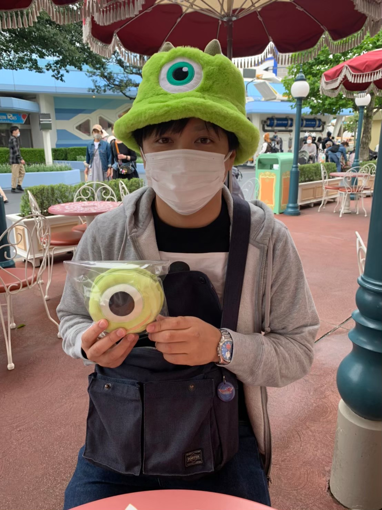
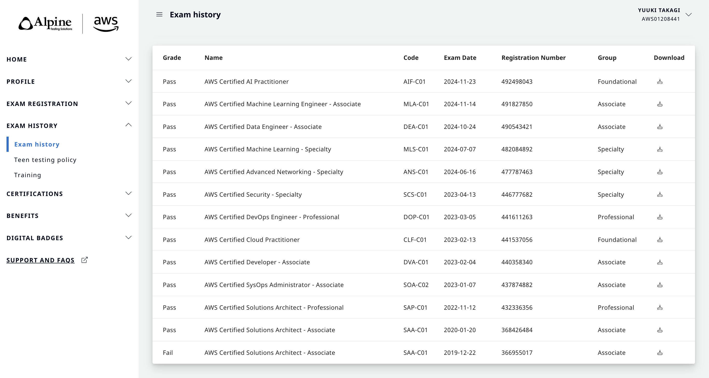
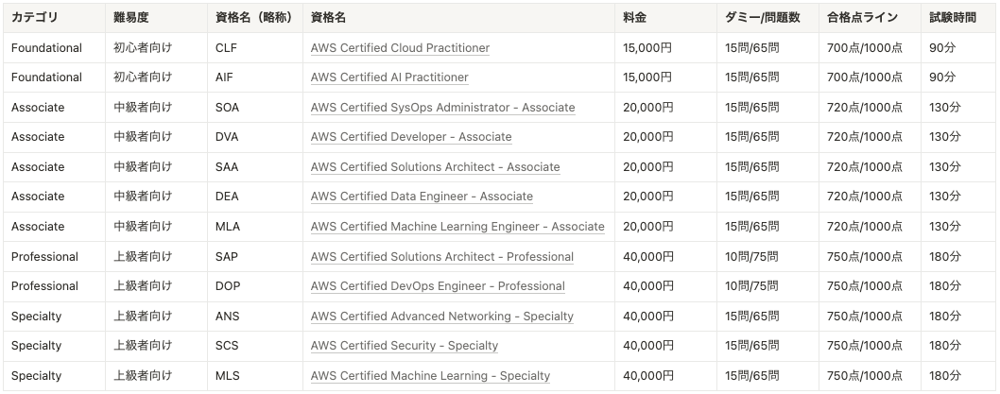
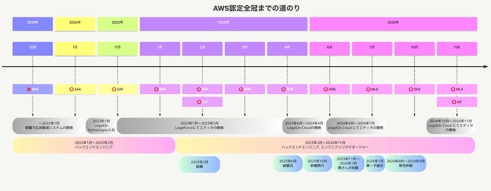
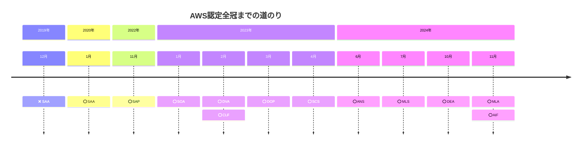
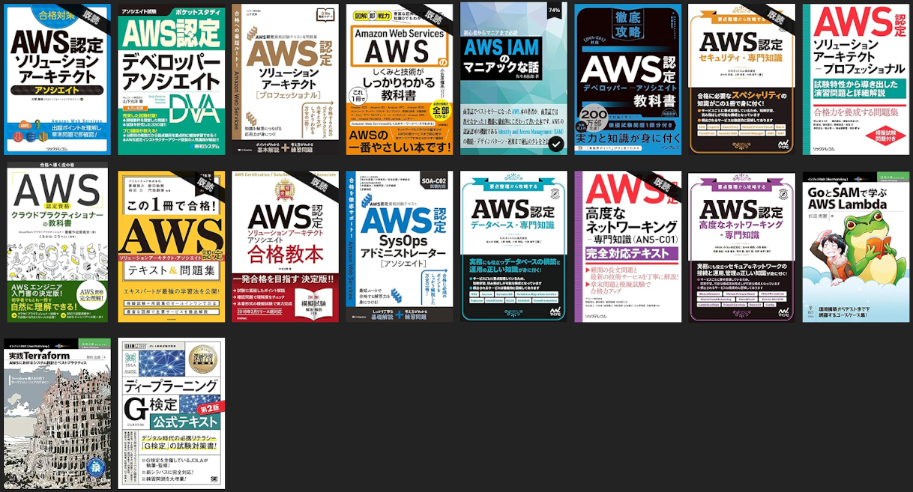

<!-- _class: center-slide -->

# AWS認定は投資か浪費か？

## 全冠から見えた価値とは？

Yuki Takagi

---

<!-- _class: top-slide -->

# はじめに

- LOT に入社して3年と2ヶ月
- Backend, PEM（最近はPMも）
- LegalForce, LegalOn Cloud ではエディタを担当（初期メンバー）
- 2024年12月から新プロダクトの方へ移動

---

<!-- _class: center-with-top-title -->

# はじめに

## ここで質問があります！
## AWS認定の取得は投資ですか？それとも浪費ですか？
## あなたはどう考えますか？

---

<!-- _class: center-with-top-title -->

# はじめに

## 最後にまた同じ質問をしますので考えてみてください。

---

<!-- _class: center-with-top-title -->

# はじめに

## 今回の発表では皆さんがAWS認定について興味を持ったり取得しようと考えている人の参考になればと思っています！
## ところでお前はそんなにAWS認定について語れるのか？

---

<!-- _class: center-with-top-title -->

# はじめに

## 安心して下さい！全部持っています！

---

<!-- _class: center-with-top-title -->

# はじめに

[認証バッジ一覧](https://www.credly.com/users/yuuki-takagi.3393fc26)

---

<!-- _class: center-with-top-title -->

# はじめに

## LOTに入社してからAWS認定を全冠したことで得られた価値について、今日はその経験を元に「AWS認定の取得は投資だったのか、浪費だったのか」一緒に考えていければと思います！
## また、これからAWS認定を取ろうかなと考えている方にとって、 少しでも参考になるような話ができればうれしいです！

---

<!-- _class: top-slide -->

# 目次

### **1. AWS認定の概要**
### 2. AWS認定全冠までの道のり
### 3. 全冠して得られたこと
### 4. 投資だったのか？浪費だったのか？
### 5. 全冠して見えたAWS認定の価値
### 6. これから挑戦する人へのアドバイス
### 7. まとめ

---

<!-- _class: top-slide -->

# 1. AWS認定の概要

- AWS認定は全部で **12種類**（2025年4月時点）
- **FOUNDATIONAL / ASSOCIATE / PROFESSIONAL / SPECIALTY** の4つに分かれる
- 費用は1回 **15,000円 〜 40,000円**
  - 全部で330,000円。ただし半額バウチャーを使うと実質**172,500円**
- 有効期限は **3年**
- 試験時間は **90分 〜 180分**

---

<!-- _class: top-slide -->

# 1. AWS認定の概要

    

---

<!-- _class: top-slide -->

# 目次

### 1. AWS認定の概要
### **2. AWS認定全冠までの道のり**
### 3. 全冠して得られたこと
### 4. 投資だったのか？浪費だったのか？
### 5. 全冠して見えたAWS認定の価値
### 6. これから挑戦する人へのアドバイス
### 7. まとめ

---

<!-- _class: top-slide -->

# 2. AWS認定全冠までの道のり

    

---

<!-- _class: top-slide -->

# 2. AWS認定全冠までの道のり

### 全冠取得までの期間

- 全冠まで **約5年** かかった（勉強していない期間も含め）
- 勉強期間だけを考えると **2年程度**

### 勉強時間

- 試験によって違うが1つの試験に対して **2週間〜1ヶ月程度**
- 1日の勉強時間は **3〜4時間程度**
- ざっくり計算だと **3時間 * 14日(2週間) * 12認定 = 504時間（勤務時間の約3ヶ月分）**

---

<!-- _class: top-slide -->

# 2. AWS認定全冠までの道のり

### 勉強方法

- 書籍: 試験範囲を網羅的に理解するのに便利
- Udemy, [Cloud License](https://cloud-license.com/): 過去問を解くことができ最も効果的
- Black Belt: 深い知識が欲しい時に使った

### 感想

- 終わりの見えない戦いに **何度も絶望した**（12冠って多くないか？）
- 今、思い返すと **ただの苦行** である

---

<!-- _class: top-slide -->

# 2. AWS認定全冠までの道のり

    

---

<!-- _class: center-with-top-title -->

# 2. AWS認定全冠までの道のり

## はっきりと言います！
## 時間もお金も気力もべらぼうに浪費します！
## でも……得たものは **確か** にあった（次章へ）

---

<!-- _class: top-slide -->

# 目次

### 1. AWS認定の概要
### 2. AWS認定全冠までの道のり
### **3. 全冠して得られたこと**
### 4. 投資だったのか？浪費だったのか？
### 5. 全冠して見えたAWS認定の価値
### 6. これから挑戦する人へのアドバイス
### 7. まとめ

---

<!-- _class: top-slide -->

# 3. 全冠して得られたこと

### スキル面で得たこと

- クラウドに限らず、**ITインフラ全体の理解が深まった**
  - セキュリティ、ネットワーク、災害復旧（DR） etc.
- **アーキテクチャ設計**の引き出しが一気に増えた
  - まだすべてを実務に生かしきれてはいないが、設計時に考えられるパターンが増えた
- **機械学習や生成AI**など、クラウドを超えた分野にも触れるきっかけになった
  - AWS認定で必然的に学ぶことになり、**基礎的な知識を体系的に身につけることができた**

---

<!-- _class: top-slide -->

# 3. 全冠して得られたこと

### キャリア・評価面で得たこと

- 体系的な知識を得たことで、実務でも **「あ、これ見たことある」** と思える場面が圧倒的に増えた
  - 新しい技術や設計の話にも、ついていける場面が増えた
- 周囲からも少なからず **「すごいね」** と声をかけられることがあった
  - **給与アップにはつながらなかった** が、 **確かな達成感** を得られた
- **難しい挑戦にも、挑み、達成できる自分を実感できた**
  - 全冠という結果が、自分自身への最大の自信につながった

---

<!-- _class: top-slide -->

# 3. 全冠して得られたこと

### 内面で得たこと

- 難しい内容でも、理解できるまで **粘り強く取り組む力** が身についた
  - わからない単語や概念に出会うたび、基礎から勉強し直すことを徹底した
- **自分の頭で説明できるレベルまで** 理解を深める習慣ができた
  - 単に暗記するのではなく、何度も説明を繰り返すことで「本当に理解する」癖がついた
- **「やればできる」** という自己信頼を得られた
  - ベンダー資格に対する苦手意識が薄れ、新たな挑戦にも前向きになれた

---

<!-- _class: top-slide -->

# 目次

### 1. AWS認定の概要
### 2. AWS認定全冠までの道のり
### 3. 全冠して得られたこと
### **4. 投資だったのか？浪費だったのか？**
### 5. 全冠して見えたAWS認定の価値
### 6. これから挑戦する人へのアドバイス
### 7. まとめ
